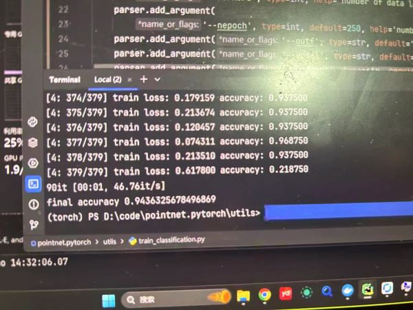
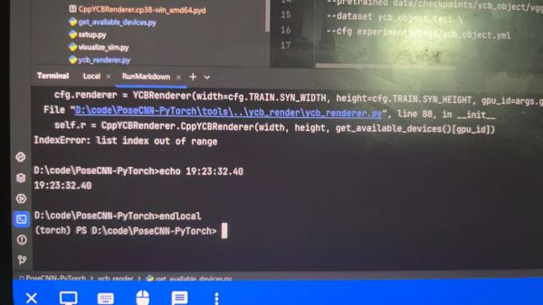
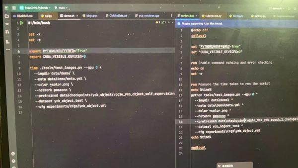

## 💼Week 2 Work Report

### 👯Overall: 
- implement the point cloud network
- learn about the poseCNN network
- try to read the article about poseCNN

### 1. Point Cloud Network

the final accuracy is 0.94

### 2. PoseCNN
project requited Ubuntu, while I use Windows, so many bugs appeared. I will try to solve them next week.
Here is where I left off:

### 3. Some intermediate steps for configuration of PoseCNN
- the `.sh` file is not executable, so I need to change it to `.bat` file, Here is an example:

- the `make` command is not recognized, so I need to install `make` and `cmake` in Windows

### 4. Next Week Plan
- Solve the bugs in PoseCNN
- read the article about PoseCNN in detail

### 5. Problems
- poseCNN is 6 years old, so many libraries are outdated, so it is hard to configure it(in Windows)
- lack of some databases for poseCnn
- it's use `cpython`, so it is hard to debug