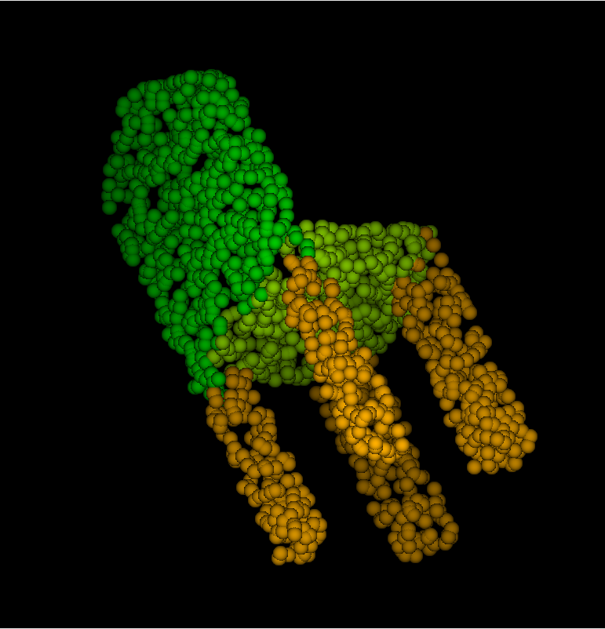
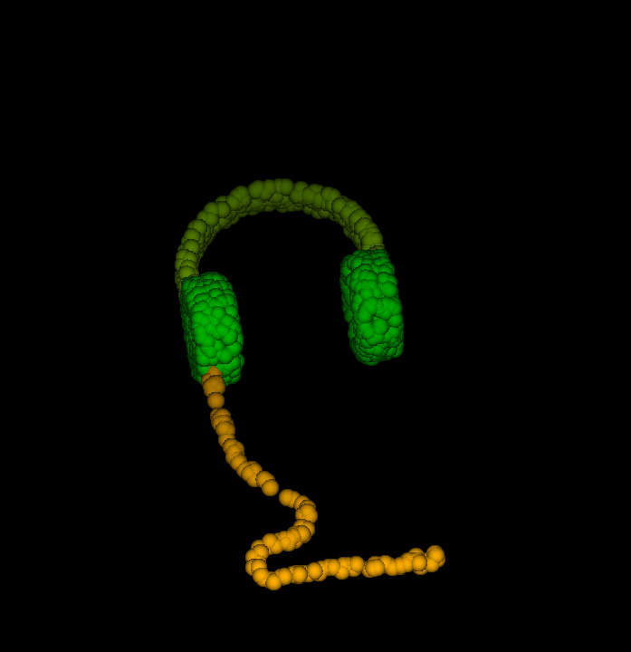

## Week 3 Work Report
1. rerun the pointNet, get the image below:
   
   
   

2. read the pointNet and pointNet++ artical

3. due to the reason of OS, still not able to run the code, but start implement pointNet++