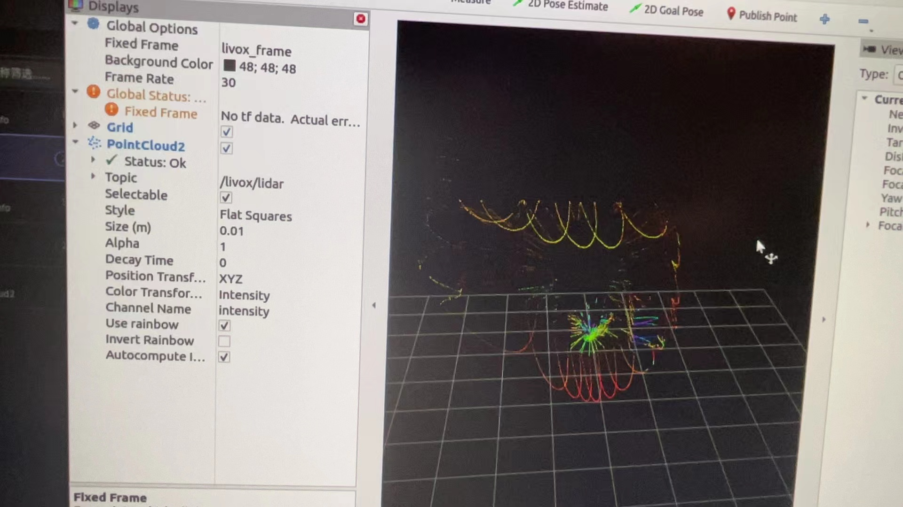

## 💼Week 5/6 Work Report

### 👯Overall: 
- get the static frame rosbag data, then trans it to the form that similar to the dataset modelnet40_normal_resampled which used in PointNet++
- use Rviz2 to visualize the data

### Here are the scripts:
[trans](./week5/trans.py) __change .db3 data to .txt file__

[addnxyz](./week5/addnxyz.py) __add x y z normal__

Here are part of the result:

### visualize:
rviz2
ros2 bag play static_data_0.db3 --loop

