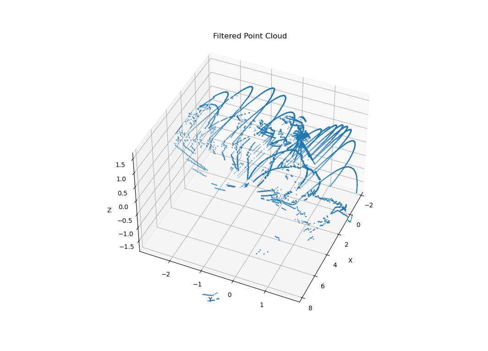

## week 6 report

### origional points:

### pca visualization:
- here is the result use pca (2 dimension)

- pca (3 dim) - it seems only regular the data

### scatter hough (after using pcs (dim = 3))
- after filted

- line 1

-line 2

-line 3

### Here are the code
- [pca code](./week6/pca.py)

- [hough code](./week6/scatter2.py) written by ZiHeng Pan